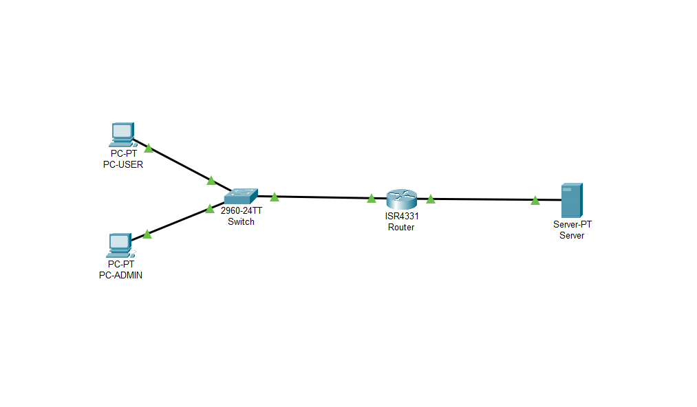
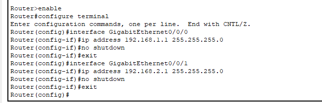
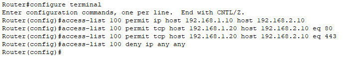
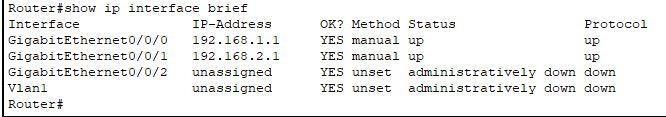
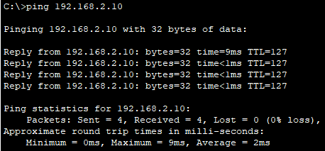
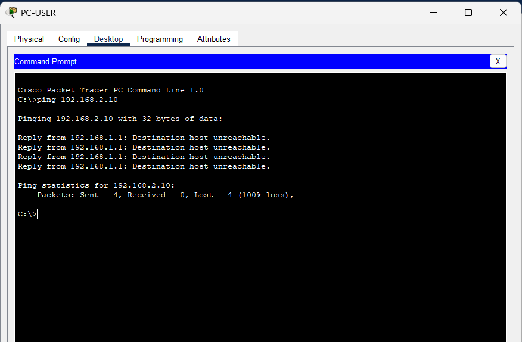

# Stateless-Firewall-Implementation-using-Cisco-Extended-ACLs
A Cisco Packet Tracer project implementing a stateless firewall using extended ACLs to enforce layer 3/4 traffic filtering, network segmentation, and least-privilege access control.

```md
# Stateless Firewall Implementation using Cisco Extended ACLs

## Project Overview
This project demonstrates the design and implementation of a **stateless network firewall** using **Cisco Extended Access Control Lists (ACLs)** in **Cisco Packet Tracer**. The firewall enforces **layer 3 and layer 4 security policies** by filtering traffic based on source IP, destination IP, protocol, and port numbers.

The objective of this project is to showcase **router-based traffic filtering**, **least-privilege access control**, and a clear understanding of how **stateless firewalls** operate in real-world networks.

---

## Network Design
- Two network segments:
  - **User LAN**
  - **Server Network**
- A Cisco router acting as a **stateless firewall**
- Traffic filtering enforced using **extended ACLs**
- Access decisions based on:
  - Source IP
  - Destination IP
  - Protocol (ICMP, TCP)
  - Destination port (HTTP/HTTPS)

---

## Security Policies Implemented
- Administrative host is granted **full network access**
- User hosts are restricted to **HTTP/HTTPS services only**
- ICMP and all other unauthorized traffic is **explicitly denied**
- Implicit deny ensures unmatched traffic is blocked by default

---

## Technologies Used
- Cisco Packet Tracer
- Cisco IOS (Extended ACL configuration)
- Router-based packet filtering

---

## Key Concepts Demonstrated
- Stateless firewalling using extended ACLs
- Layer 3 and Layer 4 traffic filtering
- Least privilege principle
- Rule-order evaluation (top-down, first match)
- Implicit deny behavior in ACLs
- Network segmentation and access control

---

## Screenshots & Verification

### 1. Network Topology
Illustrates the overall network layout, including user hosts, server network, and the router enforcing ACL-based filtering.



---

### 2. IP Address Configuration
Shows correct IP addressing on router interfaces and end devices to ensure proper layer 3 connectivity.



---

### 3. Extended ACL Creation
Demonstrates the creation of an extended ACL defining traffic rules based on IP addresses, protocols, and ports.



---

### 4. ACL Applied to Router Interface
Shows the ACL applied inbound on the router interface to filter traffic entering the protected network.



---

### 5. Allowed Traffic – Administrative Host
Verifies that the administrative host can successfully access the server network as intended.



---

### 6. Blocked Traffic – User Host
Confirms that ICMP traffic from a user host to the server network is blocked, validating ACL enforcement.



---

### 7. Allowed Service Access – HTTP
Demonstrates that the user host can access only permitted services (HTTP), validating port-based filtering.


---

## Summary of Results
- Unauthorized traffic is successfully blocked
- Approved services function as expected
- ACL rule order and implicit deny behavior operate correctly
- Firewall functions as a **stateless packet-filtering firewall**

---

## Disclaimer
All configurations and tests were performed in a **simulated lab environment** using Cisco Packet Tracer for educational and learning purposes only.
```
